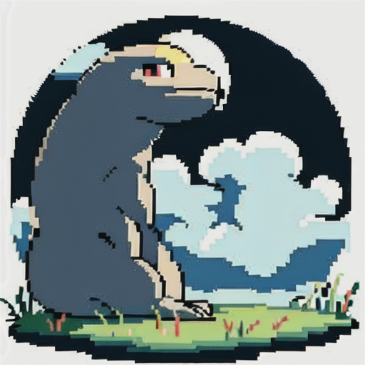

# Pixel-art-Lora-Basepixel
A lora for AI drawing, can let model drawing Pixel art style character and scenes
Welcome to CIVITAI to see more and download for a try: https://civitai.com/models/52304/pixel-art-style-lora
## Sample Outputs
Here are some sample output images:

    
    
    
    

## Discription

Image generation has been a popular research topic in
computer vision in recent years. While existing models
such as GANs and Diffusion have demonstrated impressive
results in text-to-image and image-to-image problems, the
combination of Stable Diffusion and Low-Rank Adaption of
Language Model (Lora) has shown great promise in generating
2D images with high stability and customized styles.
In this project, we explore the potential of using personal
datasets, such as a few everyday life photos, to train our
own Lora model for generating pixel art. We show that
the Stable Diffusion + Lora approach significantly reduces
the cost of retraining the model and does not require large
labeled datasets. We also demonstrate that our Basepixel
model produces high-quality and personalized pixel art.
Our results highlight the potential of the Stable Diffusion +
Lora approach in image generation and encourage further
exploration in this direction.
